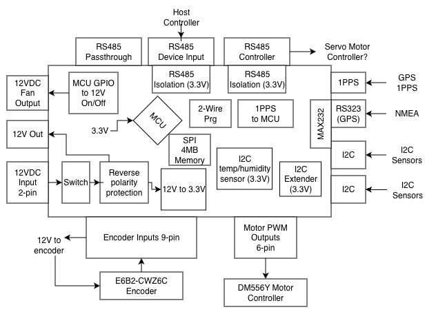

# Axis Controller

This PCB is an improved version of the mcu_test_board PCB. RS485, better isolation, fan power output and mode.

## Overview

This board follows on from the mcu_test_board. The mcu_test_board functions well, but quickly necessary improvements became evident to be able to fully service one axis of the satellite dish.

- PWM output. Isolated.
- Encoder inputs. Isolated.
- MCU will execute a PID loop.
- Upgrade to the STM32G473CET6 LQFP48. Has 512KB Flash vs 128KB.
- RS485. Isolated. With passthrough.
- MCU controllerd 12V output for fan on/off. Isolated.
- Requires only 12V input
- I2C isolation
- Onboard I2C temperature/humidity sensor. Not isolated.
- EEPROM.

## MCU

STM32G474CET6

- 512KB flash
- As of April 9, 2026 JLCPCB has 1152 in stock
- 48 pin
- JLCPCB Part # C730125 - https://jlcpcb.com/partdetail/STMicroelectronics-STM32G474CET6/C730125
- Datasheet: https://www.lcsc.com/datasheet/C730125.pdf

